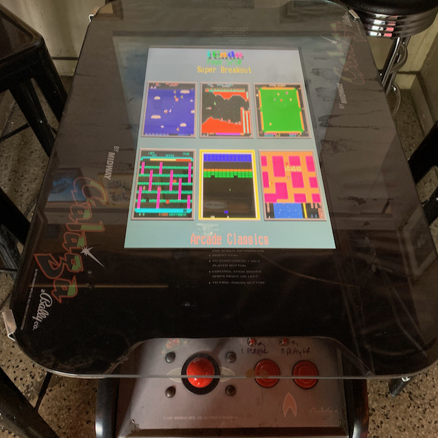

# State of the Art of Reinforcement Learning

### Hashtag #ICLR2021

...

### Introduction

With the annual [ICLR conference](https://iclr.cc/) right around the corner, have decided this year to reconsider my approach for explorations. You see there has become somewhat of an explosion of papers accepted at these top tier machine learning research venues, and well finally came to the conclusion that if you don’t approach with an objective in mind an attendee is likely to get somewhat overwhelmed amongst the forest of signal and noise. So what will be my reward function for this year’s ICLR? Trying to get caught up in the specialty of reinforcement learning.

Of course I’ve had a few brush-ins with RL here and there over my few years of independent research in the tabular learning domain, but haven’t really focused much energy on the details, and well given how even today applications are starting to make it out of benchmarking experiments into real world playgrounds like online retail and self-driving cars, well it is as good a time as any to jump in the deep end, after all industry adoption is only going to go up, at least that is my future state projection for which I am assigning a high probability.

As a quick refresher to benefit any laymen in the audience, reinforcement learning (RL) refers to a fundamental category of machine learning, sort of an in between supervised and unsupervised learning, where instead of hard coded labels of supervised learning training, the goal is to learn an agent’s policy for interacting with an environment, where by allowing an agent to run interaction experiments that policy is guided by a feedback reward signal in response to agent actions (when in parallel to the policy model you try to learn a model of the reward signal then it is considered an actor-critic framing). In some cases that reward signal may be frequent such as in the score accumulations in a video game, or in other (more difficult) cases that reward signal may be sparse such as only receiving feedback after long term goals are reached. In short, the agent and environment are approximated as a Markov Decision Process (which refers to a series of states with probabilistic transitions between, often abbreviated as MDP), and through a kind of trial and error process balancing exploration and exploitation, the agent actions and their resulting changes to the reward signal are used to hone in on an action policy that more dependably reaches higher thresholds of reward.

There are several common distinctions / subdomains in the field, will try to quickly survey a few here to aid in discussions below. Deep RL refers to approaches that incorporate deep neural networks as part of the evaluation, in fact in early forms RL was implemented without neural networks, but now almost exclusively includes building blocks such as recurrent networks for modeling time domain projections or convolutional networks for translating between pixel space and interpreted environment for instance. Q-learning (the Q does not stand for quantum I checked) is a model free approach to propagate reward signal from actions, whereas model based learning may attempt to model the environment dynamics in conjunction with learning the action policy. In some cases we may wish to control more than one agent simultaneously in an environment which may interact and interfere with goal seeking across agents, this application is known as multi-agent RL. One fundamental challenge in RL is transferring policy from a learning environment to an application environment, as it turns out the training process is in general extremely sample expensive and without special precautions will likely be very overfit to minute details of the learning environment. We’ll see further below that although the traditional direction of evaluation is to use signals from a reward function to learn a policy, it is also possible to invert and attempt to learn a reward signal by viewing a policy in action, which is known as inverse reinforcement learning. Finally there is an important distinction between RL in which an agent is able to actively interact with its environment vs passively viewing recorded samples of the domain, the latter known as offline RL.

Yeah so having offered introductions, the focus of this paper will now be to offer a few quick discussions surrounding reinforcement learning domain papers published at next week’s ICLR conference. To keep the project manageable we’ll limit our attention to those papers chosen for spotlight and oral presentations, which is a proxy for selecting papers deemed to have the most significant findings by conference chairs. In some cases the discussions may be more involved than others, this is partly indicative of my limited background in the field as in a few cases may be out of my depth. Hopefully a reader may expect to pick up a few points about current state of the art for the field. Yeah so without further ado.

...

### [Learning to Reach Goals via Iterated Supervised Learning](https://openreview.net/forum?id=rALA0Xo6yNJ)
Dibya Ghosh, Abhishek Gupta, Ashwin Reddy, Justin Fu, Coline Manon Devin, Benjamin Eysenbach, Sergey Levine

*UC Berkley, Carnegie Mellon*

In traditional RL, an agent is allowed to experiment with actions against an environment to learn a policy based on feedback from a reward signal. In imitation learning, the data is instead passively acquired by viewing actions and responses of an expert — that is some supervisor agent expert that has already achieved a suitable goal seeking policy that we would like our agent to imitate. This type of imitation learning is actually a form of supervised learning. Although not always a replacement for RL (for example in most cases we’ll have difficulty viewing full internal state of an external expert to imitate), that paradigm may still be helpful for inspiring RL algorithms, as is the case with this paper. The key idea behind this paper’s goal-conditioned supervised learning (GCSL) is that an agent’s explorations can in hindsight be translated to a form similar to what is received in imitation learning, by treating the resulting environmental state responses as a goal that the prior actions had been targeting, we can then in hindsight relabel actions with their inferred goals and environmental responses into a form of self-supervised learning similar to imitation learning, all without an expert agent to emulate. This signal can then be used to iteratively train an improved goal-oriented policy. In a way, this is a whole alternative to RL based on reward signal, as instead of learning a policy targeting some specific goal, we are instead learning a policy for all goals reached during explorations. A new way of doing things.

...

### [What Matters for On-Policy Deep Actor-Critic Methods? A Large-Scale Study](https://openreview.net/forum?id=nIAxjsniDzg)
Marcin Andrychowicz, Anton Raichuk, Piotr Stańczyk, Manu Orsini, Sertan Girgin, Raphaël Marinier, Leonard Hussenot, Matthieu Geist, Olivier Pietquin, Marcin Michalski, Sylvain Gelly, Olivier Bachem

*Google Research, Brain Team*

One of the joys of working in machine learning is just how varied are the range of hyperparameters that may be tweaked and varied to boost training speed and/or performance. Over time in deep learning researchers have honed in on a few key points to tune, such as architecture width and depth, dropout rate, learning rate, you know stuff like that. In RL the key hyperparameters are a little more varied between all of the different types of application. It was the focus of this study to apply big compute to automate the exploration of various RL hyperparameters and impact, with scale of this search something like 250,000 scenarios explored across a range of tuning configurations. I believe one of the key findings here was an unexpected significant impact originating from initialization considerations, more particularly with respect to the standard deviation of actions applied at initial explorations. The study found that lower standard deviations (around 0.5 normalized) performed better and may materially reduced the training speed. Other considerations evaluated included comparing policy loss functions, types of normalizations to apply, training setup configurations, how to handle time stamps, types of optimizers, regularizations, I mean really a whole bunch of stuff. This was a very practical paper with a whole bunch of recommendations for practitioners. I expect a really useful paper if you’re dealing with the nuts and bolts of implementations.

...

### [Learning Invariant Representations for Reinforcement Learning without Reconstruction](https://openreview.net/forum?id=-2FCwDKRREu)
Amy Zhang, Rowan Thomas McAllister, Roberto Calandra, Yarin Gal, Sergey Levine

*McGill University, Facebook AI Research, UC Berkley, University of Oxford*

Ok so this one was a little harder to follow at times, so am not sure if really going to do the paper justice with this summary. The gist of it I got was that they are proposing a new means of deriving a latent variable embedding for RL states by way of a new metric (they call it a bisimulation metric) that compares and measures distance between different states of the MDP (Markov decision process, remember that word — it’s a really central premise of RL look it up if you’re unfamiliar). Anyway just like how in word embeddings vector path distances can translate to interpretation deltas (e.g. king - man + woman = queen), with this latent variable reconstruction they are able to constrain training such that distances in state space are treated as direct correspondence to distances in latent embedding space. By deriving these latent representations, they are able to reduce the dimensionality of their exploration policy, just as an arbitrary example, consider a self-driving car operating during mid-day verses during the night time, although the camera readings are going to have very different lighting effects, think headlights, color shading, etc., in this latent representation those differences are abstracted away to only consider the key points of staying in your lane and avoiding other cars. So to return to a central component of this work, the bisimulation metric helps to identify those conditions that may vary a lot in state recordings, but have very similar action/reward sequences, and as a result treating them as having a comparable latent state.

...

### [SMiRL: Surprise Minimizing Reinforcement Learning in Unstable Environments](https://openreview.net/forum?id=cPZOyoDloxl)
Glen Berseth, Daniel Geng, Coline Manon Devin, Nicholas Rhinehart, Chelsea Finn, Dinesh Jayaraman, Sergey Levine

*UC Berkeley, Stanford, University of Pennsylvania*

One of the most fundamental features of a RL algorithm is that action policy tuning relies on feedback from a reward signal to guide iterations. For example, in a video game environment the reward policy might be a running score, in a self driving car simulation the reward might be avoiding collisions and reaching destinations. In some real world applications, it may be found that a reward signal is harder to define. For instance we may want our agent to learn how to interact with the environment in a manner that is flexible towards what goal is presented. Researchers have approached these cases by trying to identify an intrinsic reward signal, one that encourages diverse explorations of the action impact pairs while leading to a productive learned policy that is capable of having intentional influence on it’s surroundings, resulting in a kind of unsupervised RL. In prior work, many researchers have applied intrinsic rewards that encourage explorations that result in some form of novelty, which turn out to be particularly well suited for video game environments where novel events happen when an agent follows some coherent pattern of behavior. The premise of this work is that in real world applications, novelty seeking may in fact be redundant with what is already taking place with the environment, after all in the real world the second law says entropy trends up with time, and so a better intrinsic reward might instead be to seek stability in an environment of inevitable surprises. Thus the surprise minimizing reinforcement learning (SMiRL) algorithm seeks to minimize the amount of surprise experienced by an agent, sort of a polar opposite of the novelty seeking approach, and it turns out they were able to demonstrate that this approach works in a host of benchmarking experiments.

...

### [Mutual Information State Intrinsic Control](https://openreview.net/forum?id=OthEq8I5v1)
Rui Zhao, Yang Gao, Pieter Abbeel, Volker Tresp, Wei Xu

*Ludwig Maximilian University of Munich, Siemens AG, Tsinghua University, UC Berkeley, Horizon Robotics*

In some ways this paper bears similarity to the (SMiRL) one preceding in this essay, as it is a paper proposing a new type of intrinsic reward for RL that may work in place of some explicit reward function. Expanding on what has otherwise been studied in prior art, other types of proposed intrinsic rewards have included metrics based on curiosity, diversity, and empowerment. In deriving a new type of intrinsic reward here, one fundamental way that this research differs is that the policy / reward interactions make a distinction between the boundaries of the agent and the environment — typically a RL’s MDP approximation treats the agent and environment as a combined system with one aggregate state at each time step. This boundary distinction becomes useful for their MUtual information-based State Intrinsic Control (MUSIC) algorithm, which as an aside I just want to hereby award the paper first prize for best acronym of the conference. By setting this boundary, the MUSIC sets a reward metric based on maximizing the achieved mutual information between the agent and the surrounding state — which turns out to be a useful proxy for identifying cases where the agent is exhibiting control to the environment. In their benchmarking experiments the researchers demonstrate the success of MUSIC at learning robotic pick-and-place tasks, the first time this type of benchmark has been learned without any explicit task reward.

...

### [Self-Supervised Policy Adaptation during Deployment](https://openreview.net/forum?id=o_V-MjyyGV_)
Nicklas Hansen, Rishabh Jangir, Yu Sun, Guillem Alenyà, Pieter Abbeel, Alexei A Efros, Lerrel Pinto, Xiaolong Wang

*UC San Diego, Technical University of Denmark, IRI, CSIC-UPC, UC Berkeley, NYU*

The authors describe challenges with traditional RL for cases where models are trained in an environment with access to a reward signal and then adapted to use in a new environment where the reward signal is not present — as an example this could be the case for robotics control trained in a simulated domain and then adapted to real world use. A traditional solution to this challenge is for the initial training to attempt to learn policies invariant to the environment, such as by domain randomization in which data augmentation is used to increase diversity of training environment. The authors propose an alternative in which an additional self supervised model is trained adjacent to the policy in the environment with the reward signal, and then when the model is adapted to the new environment without reward signal the self-supervised model is used as a signal to translate back to the original reward environment. Here the self supervised model is learning the inverse dynamics of the system. They call this approach Policy Adaptation during Deployment (PAD).

...

### [Discovering a set of policies for the worst case reward](https://openreview.net/forum?id=PUkhWz65dy5)
Tom Zahavy, Andre Barreto, Daniel J Mankowitz, Shaobo Hou, Brendan O’Donoghue, Iurii Kemaev, Satinder Singh

*Deepmind*

The authors present a common scenario where an agent is simultaneously exposed to multiple reward signals for multiple tasks, and from the set of policies associated with each task must combine them into a single policy that manages to balance performance across those reward signals. As intuition might suggest, balancing policy towards what may at times be contradictory reward signals may require tradeoffs between performance against each. This paper seeks to promote those tradeoffs that adhere to a particular property, that of maximizing the performance of the worst case reward associated with the combined set of policies. The algorithmic details of how to implement are presented, I won’t go into a lot of detail here but as a high level hand wave they involve an iterative procedure including developing sets that maximize rewards over policies as well as sets that maximize the worst case reward over policies. Importantly, benchmarking experiments in optimizing for the worst case reward demonstrated a small improvement in performance to the entire distribution with small complexity cost. Yeah so good paper, was a little overwhelmed by so many acronyms at times, kind of a bit of alphabet soup if you know what I mean.

...

### [Data-Efficient Reinforcement Learning with Self-Predictive Representations](https://openreview.net/forum?id=uCQfPZwRaUu)
Max Schwarzer, Ankesh Anand, Rishab Goel, R Devon Hjelm, Aaron Courville, Philip Bachman

*MILA, Microsoft*

Mainstream RL is not very sample efficient to say the least. Supervised learning (i.e. non RL learning) has made great leaps in sample efficiency by way of semi-supervised techniques in which data augmentations are used to greatly multiply the training data. In RL, data augmentation is not completely new. But the novel solution to sample efficiency proposed here is an extension in which parallel to policy learning by q-learning, a model is trained to predict future states based on actions in a latent space encoding. This prediction is then in hindsight compared to the actual state latent space after reaching that time delta to extract a loss signal. Coupled with the state projection data augmentation can be applied to further boost sample efficiency. They call this tactic Self-Predictive Representations (SPR). Benchmarking experiments on Atari games found the method out-performs state of the art. (I was somewhat reminded here of the first paper in this writeup, although they appear different in that in first paper we were using hindsight to derive goals for prior actions, here we’re using hindsight to train a model for future state predictions, also the integration with data augmentation.)

...

### [UPDeT: Universal Multi-agent RL via Policy Decoupling with Transformers](https://openreview.net/forum?id=v9c7hr9ADKx)
Siyi Hu, Fengda Zhu, Xiaojun Chang, Xiaodan Liang

*Monash University, Sun Yat-sen University, Dark Matter AI Inc.*

Multi-agent RL refers to cases where we are trying to learn a policy for more than one agent interacting in the same environment, which may complicate due to interactions or interference between agents, as the RL may have difficulty distinguishing due to the same MDP approximation discussed earlier (for the Mutual Information State Intrinsic Control paper), referring to treating the agent and environment as a combined MDP system with one aggregate state at each time step, which may get somewhat muddy as you keep introducing additional agents. So this paper serves to decouple the various agents with importance weightings by a self-attention mechanism, with the transformer also serving to decouple the policy distribution from the input observations. They call this method Universal Policy Decoupling Transformer (UPDeT). They consider this framing a universal technique since it results in a framework with no limitation on input or output dimension and can thus be plugged in to any multi-agent model. The universality really comes in handy when you consider that in prior art multi agent RL techniques one otherwise might have had to fully retrain a model with transfers such as increasing difficulty by number of agents. Here in benchmarking experiments they demonstrate a 10x training speedup with performance boost for transfer.

...

### [What are the Statistical Limits of Offline RL with Linear Function Approximation?](https://openreview.net/forum?id=30EvkP2aQLD)
Ruosong Wang, Dean Foster, Sham M. Kakade

*Carnegie Mellon University, University of Pennsylvania and Amazon, University of Washington Seattle, Microsoft Research*

This paper was kind of a departure from most of those preceding, as was much more of a theoretical work, deriving a proof for bounding training efficiency in the application of offline RL. Offline RL again refers to cases where instead of learning a policy from an agent interacting with an environment with loss propagated by impact towards a reward signal, one is instead passively viewing an external agent’s interactions with said environment. Surprisingly, they found that even with simplifying assumptions such as cases where the value of every policy is linear and samples have a good coverage over features, offline RL requires an exponential number of samples to reliably estimate policy. Further, they demonstrate that in order for offline RL to achieve sample efficiency, a much higher burden of conditions are required, such as offline data distribution closely adhering to the desired policy distribution. (Not to get too bent out of shape, as this type of higher burden would be consistent with cases where offline RL is following the actions of an expert supervisor whose policy we are trying to emulate, also known as imitation learning, or the similar but distinct learning of a reward signal from viewing actions of expert which is known as inverse RL.)

...

### [Regularized Inverse Reinforcement Learning](https://openreview.net/forum?id=HgLO8yalfwc)
Wonseok Jeon, Chen-Yang Su, Paul Barde, Thang Doan, Derek Nowrouzezahrai, Joelle Pineau

*MILA, McGill, Facebook AI Research*

Inverse Reinforcement Learning (IRL) refers to a framework where a reward function is unknown but an active agent responding to the reward function is visible, such that a model of the reward can be learned by observing the independent agent acting in response to that reward signal or even better acting with a known policy that was derived from the reward signal we would like to model. In regularized (non-inverse) RL, a regularization term is added to the reward signal, such as may be applied based on entropy estimates like Shannon entropy or Tsallis entropy. To give you an idea of how this helps, consider a scenario where an agent is interacting with an environment without reward feedback, such as if around the given state space the reward signal was a constant. In this case there may be multiple versions of constant policy to achieve the same reward signal — known as degenerate solutions. The regularizing term solves this by reducing policy space, even in cases of constant reward signal, to a single optimal policy. Prior art for regularized inverse RL offered solutions that without adequate simplifying assumptions could be considered intractable. This work demonstrates a tractable regularized IRL solution for discrete control problems, which again by incorporating a regularization term such as with Tsallis entropy allows for a single policy associated with even constant reward. They even extend this solution to applications for adversarial inverse reinforcement learning, which is a form of IRL that incorporates a discriminator like you’d see in GAN technology (that is generative adversarial networks, in case you didn’t recognize the GAN acronym in this context). So yeah to be honest with this paper I felt a little out of my depth, apologies to the authors if I did not do the work justice.

...

### [Image Augmentation Is All You Need: Regularizing Deep Reinforcement Learning from Pixels](https://openreview.net/forum?id=GY6-6sTvGaf)
Denis Yarats, Ilya Kostrikov, Rob Fergus

*New York University, Facebook AI Research*

Great so as our final entry to the RL themed spotlight presentations, this work had a touching title that is obviously a sly reference to the Beatles track of similar name, you know the one. (Are we still paying attention?) Anyway, in real world applications, it is common that we only have access to a limited amount of interactions with an environment — such as would be the case when we are unable to accurately simulate complex dynamics and so a mirror system is unavailable for virtualized agent / reward interactions. This paper seeks to demonstrate that even for this constraint, sample efficient RL is possible by applying just standard image data augmentations — as are already well researched and available in mainstream libraries for supervised learning applications. Not only do data augmentations benefit, they also appear to enable direct training from image pixels (i.e. making possible model free RL). Putting this into practice, one implementation detail was that for the set of augmented images produced from a single sample, the algorithm was set to ensure that the Q-learning critic interprets adjacent augmentations from the same image as having similar Q-function values. Yeah in short data augmentations have become very common practice for state of the art in vision and speech domains, while in RL have not received quite as much attention from researchers. This paper demonstrates that the time has come for a change.

...

### Conclusion

Thanks for offering your time to peruse these summaries. All credit goes to the original authors for advancing state of the art, I am mostly an observer in this field. One small thank you to a podcast series which I binged in preparation for this writeup, referring to [TalkRL](https://podcasts.apple.com/us/podcast/talkrl-the-reinforcement-learning-podcast/id1478198107) from Robin Ranjit Singh Chahuan, which have found to be a reliable source for in depth interviews with researchers in the field of RL. Looking forward to the ICLR conference next week, hope to get a chance to say hello to a few of these researchers in person. Obviously by limiting my focus to oral and spotlight presentations I left out a whole lot of RL papers that managed to get published in this very exclusive venue, so if you found this material interesting perhaps a good next step could be to check out a few more RL papers from the poster sessions. Yeah and last thing, if you enjoyed or got some value from this writeup, perhaps you might as a thank you spend five minutes checking out (anonymized), which is a python library platform for preparing tabular data for machine learning. Until next time.

...

### Bibliography
<a name="Ghosh">Dibya Ghosh, Abhishek Gupta, Ashwin Reddy, Justin Fu, Coline Manon Devin, Benjamin Eysenbach, Sergey Levine. **Learning to Reach Goals via Iterated Supervised Learning**. *International Conference on Learning Representations*, 2021.</a>
  
<a name="Andrychowicz">Marcin Andrychowicz, Anton Raichuk, Piotr Stańczyk, Manu Orsini, Sertan Girgin, Raphaël Marinier, Leonard Hussenot, Matthieu Geist, Olivier Pietquin, Marcin Michalski, Sylvain Gelly, Olivier Bachem. **What Matters for On-Policy Deep Actor-Critic Methods? A Large-Scale Study**. *International Conference on Learning Representations*, 2021.</a>
  
<a name="Zhang">Amy Zhang, Rowan Thomas McAllister, Roberto Calandra, Yarin Gal, Sergey Levine. **Learning Invariant Representations for Reinforcement Learning without Reconstruction**. *International Conference on Learning Representations*, 2021.</a>
  
<a name="Berseth">Glen Berseth, Daniel Geng, Coline Manon Devin, Nicholas Rhinehart, Chelsea Finn, Dinesh Jayaraman, Sergey Levine. **SMiRL: Surprise Minimizing Reinforcement Learning in Unstable Environments**. *International Conference on Learning Representations*, 2021.</a>
  
<a name="Zhao">Rui Zhao, Yang Gao, Pieter Abbeel, Volker Tresp, Wei Xu. **Mutual Information State Intrinsic Control**. *International Conference on Learning Representations*, 2021.</a>
  
<a name="Hansen">Nicklas Hansen, Rishabh Jangir, Yu Sun, Guillem Alenyà, Pieter Abbeel, Alexei A Efros, Lerrel Pinto, Xiaolong Wang. **Self-Supervised Policy Adaptation during Deployment**. *International Conference on Learning Representations*, 2021.</a>
  
<a name="Zahavy">Tom Zahavy, Andre Barreto, Daniel J Mankowitz, Shaobo Hou, Brendan O’Donoghue, Iurii Kemaev, Satinder Singh. **Discovering a set of policies for the worst case reward**. *International Conference on Learning Representations*, 2021.</a>
  
<a name="Schwarzer">Max Schwarzer, Ankesh Anand, Rishab Goel, R Devon Hjelm, Aaron Courville, Philip Bachman. **Data-Efficient Reinforcement Learning with Self-Predictive Representations**. *International Conference on Learning Representations*, 2021.</a>
  
<a name="Hu">Siyi Hu, Fengda Zhu, Xiaojun Chang, Xiaodan Liang. **UPDeT: Universal Multi-agent RL via Policy Decoupling with Transformers**. *International Conference on Learning Representations*, 2021.</a>
  
<a name="Wang">Ruosong Wang, Dean Foster, Sham M. Kakade. **What are the Statistical Limits of Offline RL with Linear Function Approximation?**. *International Conference on Learning Representations*, 2021.</a>
  
<a name="Jeon">Wonseok Jeon, Chen-Yang Su, Paul Barde, Thang Doan, Derek Nowrouzezahrai, Joelle Pineau. **Regularized Inverse Reinforcement Learning**. *International Conference on Learning Representations*, 2021.</a>
  
<a name="Yarats">Denis Yarats, Ilya Kostrikov, Rob Fergus. **Image Augmentation Is All You Need: Regularizing Deep Reinforcement Learning from Pixels**. *International Conference on Learning Representations*, 2021.</a>
  
  
